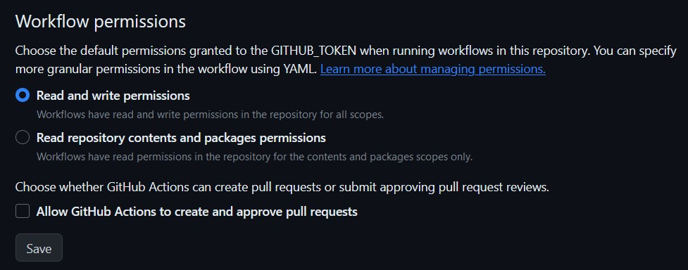

   
  
  <!-- <h1>.project-provider</h1> -->
  

    Automatic project provider tool for your Github projects.
  

<!-- Badges -->

   
   
   
   

---

-   [Concept](#concept)
-   [Configuration](#configuration)
-   [Projects file](#projects-file)
-   [Get your own .project-provider](#get-your-own-project-provider)
-   [Run the .project-provider locally](#run-the-project-provider-locally)

---

## Concept

The .project-provider provides some meta information about your projects. The informations are stored in a json file that will be updated by a github actions workflow.

---

## Configuration

You can set the configuration in the `.conf` file. The configuration file is a simple key-value file. The key is the name of the configuration and the value is the value of the configuration.

### Name

Specify the github username you want to get the projects from.

### Output

Specify the path to the output file. The path is relative to the root directory of the project.

### Project_Files

Specify a comma separated list of file names that the project provider should look for in the root directory of your projects. The file itself can contain some more meta information about your project. Take a look at the [Projects file](#projects-file) section to see how a project file looks like.

### Timestamp

A path to a file where the timestamp of the last update will be stored. The path is relative to the root directory of the project.

### Log_File

A path to a file where the log of the last update will be stored. The path is relative to the root directory of the project.

### Log_Length

The maximum length of the log file. If the log file is longer than the specified length, the log file will be truncated.

### Banner

Path to the banner file. The path is relative to the root directory of the project.

---

## Projects file

A project file contains some more meta information about your project and is there so the project is recognized by the .project-provider. The file has to be stored in the root directory of your project and has to follow the naming convention of the `project_files` configuration. The file is a simple key-value file, where the key is the name of the meta information and the value is the value of the meta information.

### Properties

All properties are optional!

-   **logo**: The path to the logo of the project. The path is relative to the root directory of the project. This property will be used by the project provider to generate a url to the logo.
-   **logo_small**: The path to the logo of the project. The path is relative to the root directory of the project. This property will be used by the project provider to generate a url to the logo.
-   **description_translate**: A comma separated list of languages. The description of your github project will be translated to the languages specified in this property. The languages have to be specified in the [ISO 639-1](https://en.wikipedia.org/wiki/List_of_ISO_639-1_codes) format.
-   **version**: The version of the project.
-   **ignore**: If you want that the project-provider ignores the project, without deleting the project file, you can add a simple _ignore_ property to the project file. The value of the property doesn't matter. If the property is present, the project will be ignored.

Take a look at the [example project file](.project.template) to see how a project file looks like.

---

## Get your own .project-provider

If you want to automate your project management, you can use the .project-provider. To get your own .project-provider you can follow these steps:

1. Fork this repository
2. Create a new github repository with the forked repository as template
3. Edit the `.conf` file to your needs
4. Set write permissions for the github actions workflow to the repository:

-   Go to the settings of your repository
-   Navigate to _Actions > General_ and enable _Read and write permissions_
-   Click on _Save_

The last thing to do is to set up the project files in your projects, so the project provider can find them. Take a look at the [Projects file](#projects-file) section to see how a project file looks like.

> If you want you can set the update time to your needs. Go to the [get_projects_schedule.yaml](.github/workflows/get_projects_schedule.yaml) file and edit the cron expression.

---

## Run the .project-provider locally

If you want to run the project provider locally, you can follow these steps:

1. Download the latest release
2. Make sure you have python installed
3. Install the dependencies with `pip install -r requirements.txt`
4. Run the project provider with `python main.py`

> If you need help run `python main.py -help`

---

by [Philipp B.](https://github.com/phil1436)

[https://raw.githubusercontent.com/phil1436/.project-provider/main/projects.json](https://raw.githubusercontent.com/phil1436/.project-provider/main/projects.json)
